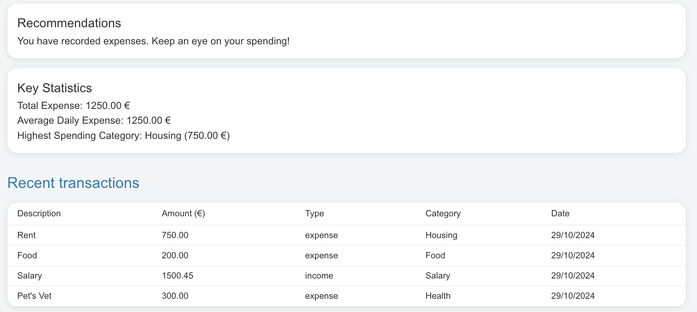

# Personal budget assistant

## The Game is HackathON React Frontend Challenge by Nuwe and CaixaBank Tech

<div align="center">
</div>

The Personal Budget Assistant is a web application designed to help users efficiently manage their personal finances. It allows users to track expenses, create budgets, and provides alerts and advices when spending limits are exceeded or you are saving up money.

## Table of contents

1. [Introduction](#the-game-is-hackathon-react-frontend-challenge-by-nuwe-and-caixabank-tech)
2. [Key Features](#key-features)
3. [Technologies Used](#technologies-used)
4. [Installation](#installation)
5. [Usage](#usage)
6. [Image Gallery and Features](#image-gallery-and-features)
6. [Contributing](#contributing)
8. [Author](#author)


## Key features

- **User Authentication:** Users can sign up and log in to access their budget data.
- **Budget Management:** Create and manage personalized budgets, with alerts for overspending.
- **Data Visualization:**
    - **Income vs. Expenses by Category:** This chart displays the comparison between income and expenses categorized by different spending types, helping users identify where they are allocating their funds.

    - **Balance Over Time:** This chart visualizes the user's balance over time, allowing users to track their financial progress and see trends in their income and expenses.

- **Notifications and Alerts:** Receive alerts when budget limits are exceeded globally and by category.
- **CRUD Operations:** Create, Read, Update, and Delete transactions easily.
    - **Filters in CRUD:** Filter transactions based on categories, dates, and amounts.
- **Responsive Design:** The interface is designed to be fully responsive, adapting to different devices.
- **Dark/Light Theme:** Switch between dark and light themes for a personalized experience.
- **Download Transactions:** Export transactions data in JSON format.
- **Trend Analysis:** Analyze spending trends over time and export data to CSV.
- **Support Page:** Access support with direct email contact and API connection that fetch support contacts list.
    - **Search bar:** Quickly find specific support contact.

## Technologies Used

[](https://reactjs.org/)   [](https://reactjs.org/docs/hooks-custom.html)   [](https://reactjs.org/docs/typechecking-with-proptypes.html)   [](https://reactrouter.com/)                     


## Installation

1. Clone the repository:

   ```bash
   git clone https://github.com/Luovtyrell/personal-budget-assistant.git
   ```

2. Navigate to the project directory:

   ```bash
   cd personal-budget-assistant
   ```

3. Install the dependencies:

   ```bash
   npm install
   ```

4. Start the development server:

   ```bash
   npm start
   ```
<br>

## Usage

1. **Registration**: To get started, register or alternatively, you can use the default credentials to log in.

2. **Dashboard**: After logging in, you’ll access the dashboard where you can view a summary of your financial data, including your latest transactions, visual graphs and advices.

3. **Transactions**: Navigate to the "Transactions" section to add, edit, or delete transactions. You can also filter transactions.

4. **Trend Analysis**: In the "Analysis" section, you can observe trends in your income and expenses over time.

5. **Settings**: In "Settings," you can set a total budget limit or budget limits for specific categories.

6. **Support Page**: The "Support Page" provides contact information and you can search for a contact in the search bar.


## Image Gallery and Features

| **Image**                                                      | **Feature**                           |
|-----------------------------------------------------------------|--------------------------------------|
|  | **Financial Sumary**              |
|    | **Recommendations, key statics and recent transactions**           |
|        | **Transactions list CRUD and filters**         |
|  | **Budget limit settings global or by category**        |
|    | **Trend analysys (income and expenses trend)**                  |
|  | **Support contact list and search bar**                  |
|  | **Responsive layout**                  |
|  | **Dark/light theme switcher**                  |

<br><br>

## Contributing

If you'd like to contribute, please follow these steps:

1. Fork the repository
2. Create a new branch (`git checkout -b feature/AmazingFeature`)
3. Make your changes
4. Commit your changes (`git commit -m 'Add some AmazingFeature'`)
5. Push to the branch (`git push origin feature/AmazingFeature`)
6. Open a Pull Request

<br>

## Author

[](https://github.com/Luovtyrell) <a href="https://www.github.com/Luovtyrell"> <br>

</a>

<a href="mailto:luciaorvilanova@gmail.com" target="_blank" rel="noreferrer"></a> <a href="https://www.linkedin.com/in/luovtyrell" target="_blank" rel="noreferrer"></a> <a href="https://t.me/luovtyrell" target="_blank" rel="noreferrer"></a> <a href="http://discordapp.com/users/664163194989707308" target="_blank" rel="noreferrer"></a> 
